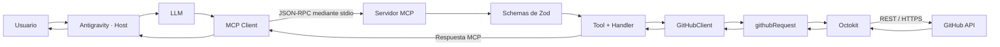
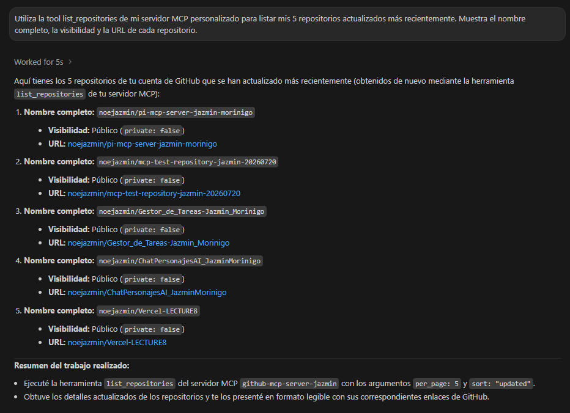
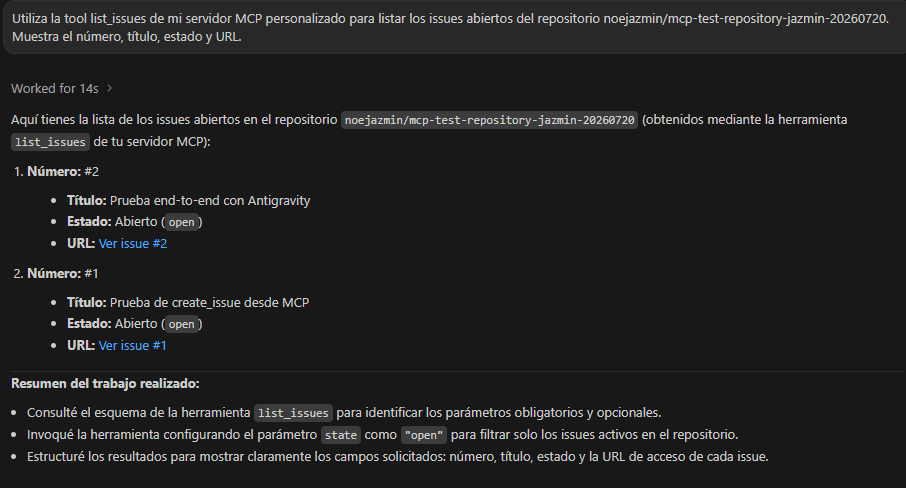
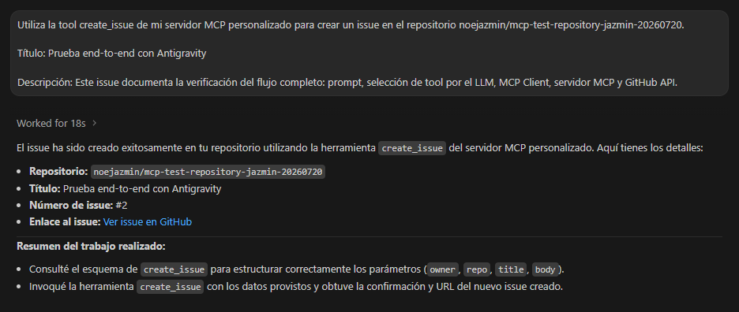
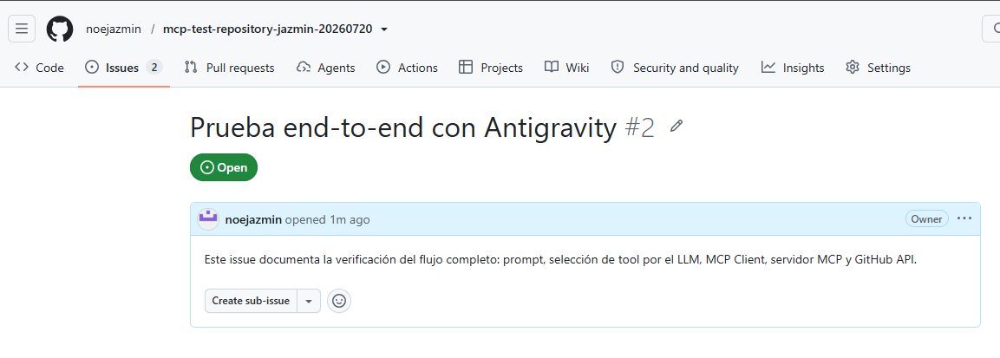
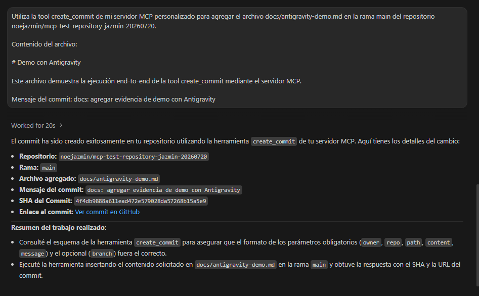
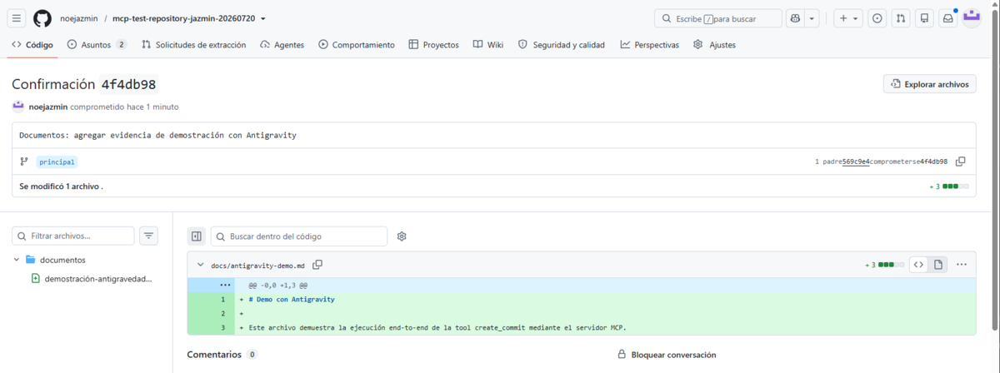

<div align="center">

# Servidor MCP para GitHub

### Integración entre agentes de IA y GitHub mediante herramientas controladas

[](https://nodejs.org/)
[](https://www.typescriptlang.org/)
[](https://modelcontextprotocol.io/)
[](https://docs.github.com/en/rest)
[](https://vitest.dev/)
[](#licencia)

</div>

---

## Descripción

Servidor MCP desarrollado con Node.js y TypeScript que permite que un agente de inteligencia artificial solicite operaciones controladas sobre GitHub mediante tools con contratos explícitos de entrada y salida.

El servidor utiliza Zod para validar los datos, Octokit para comunicarse con la API REST de GitHub y un sistema centralizado para clasificar errores, controlar reintentos y construir respuestas MCP entendibles.

El proyecto fue desarrollado como Proyecto Integrador del módulo M5 y busca demostrar:

- Comprensión de la arquitectura Host–Client–Server de MCP.
- Diseño de tools con schemas claros.
- Integración segura con GitHub mediante Octokit.
- Separación de responsabilidades.
- Manejo y transformación de errores.
- Testing con Vitest y mocks.
- Uso de variables de entorno.
- Integración con Antigravity y MCP Inspector.

---

## Estado actual

- **8 tools implementadas.**
- **5 tools obligatorias.**
- **3 tools avanzadas de extra credit.**
- **33 tests automatizados aprobados.**
- **Typecheck y build aprobados.**
- **Integración MCP–GitHub verificada mediante MCP Inspector.**
- **Flujo end-to-end verificado con Antigravity para operaciones de lectura y escritura.**

> Las tres tools de extra credit se encuentran implementadas y cubiertas por tests. Su verificación externa con MCP Inspector y Antigravity se realizará antes de cerrar la versión final del proyecto.

---

## Flujo principal



### Responsabilidades

| Componente | Responsabilidad |
|---|---|
| Usuario | Expresa una intención mediante lenguaje natural. |
| Antigravity | Cumple el rol de Host y administra la experiencia del agente. |
| LLM | Interpreta el prompt y selecciona una tool disponible. |
| MCP Client | Descubre tools y envía solicitudes MCP estructuradas. |
| Servidor MCP | Publica capacidades, valida datos y ejecuta handlers. |
| Handler | Coordina la operación y construye la respuesta MCP. |
| GitHubClient | Expone operaciones simplificadas y adapta los datos. |
| `githubRequest` | Extrae datos, transforma errores y controla reintentos. |
| Octokit | Construye solicitudes REST hacia GitHub. |
| GitHub API | Procesa la solicitud y aplica la operación sobre el recurso. |

---

## Tecnologías

| Tecnología | Uso |
|---|---|
| Node.js | Entorno de ejecución del servidor. |
| TypeScript | Tipado estático y organización del código fuente. |
| MCP SDK | Creación del servidor, registro de tools y transporte `stdio`. |
| Zod | Validación de schemas de input y output. |
| Octokit | Cliente oficial para utilizar la API REST de GitHub. |
| dotenv | Carga de variables de entorno desde `.env`. |
| Vitest | Ejecución de tests automatizados. |
| Git y GitHub | Control de versiones, repositorio y evidencia de las operaciones. |
| Antigravity | Host utilizado para conectar el LLM con el servidor MCP. |
| MCP Inspector | Inspección y prueba directa de las tools MCP. |

---

## Tools disponibles

### Tools obligatorias

| Tool | Tipo | Descripción |
|---|---|---|
| `list_repositories` | Lectura | Lista repositorios accesibles para la cuenta autenticada. |
| `create_repository` | Escritura | Crea un repositorio con los datos validados. |
| `create_issue` | Escritura | Verifica el repositorio y crea un issue. |
| `list_issues` | Lectura | Lista issues por estado y excluye pull requests. |
| `create_commit` | Escritura | Agrega o reemplaza un archivo mediante objetos Git. |

### Tools avanzadas

| Tool | Tipo | Descripción |
|---|---|---|
| `list_commits` | Lectura | Lista los commits recientes de una rama. |
| `add_comment_to_issue` | Escritura | Agrega un comentario en Markdown a un issue existente. |
| `close_issue` | Escritura | Cierra un issue específico. |

---

## Documentación de las tools

### `list_repositories`

Lista los repositorios disponibles para la cuenta autenticada.

| Parámetro | Tipo | Requerido | Valor predeterminado |
|---|---|---:|---|
| `type` | `"all" \| "public" \| "private"` | No | `"all"` |
| `sort` | `"created" \| "updated" \| "pushed" \| "full_name"` | No | `"updated"` |
| `per_page` | `number` entre 1 y 100 | No | `30` |

Ejemplo de prompt:

```text
Utiliza list_repositories para mostrar mis cinco repositorios actualizados más recientemente.
```

---

### `create_repository`

Crea un repositorio para la cuenta autenticada.

| Parámetro | Tipo | Requerido | Descripción |
|---|---|---:|---|
| `name` | `string` | Sí | Nombre del repositorio. |
| `description` | `string` | No | Descripción del repositorio. |
| `private` | `boolean` | No | Indica si será privado. Por defecto es `false`. |

Ejemplo de prompt:

```text
Crea un repositorio público llamado mcp-demo con una descripción sobre pruebas de MCP.
```

---

### `create_issue`

Crea un issue después de verificar el repositorio mediante un preflight.

| Parámetro | Tipo | Requerido | Descripción |
|---|---|---:|---|
| `owner` | `string` | Sí | Usuario u organización propietaria. |
| `repo` | `string` | Sí | Nombre del repositorio. |
| `title` | `string` | Sí | Título del issue. |
| `body` | `string` | No | Descripción en Markdown. |

Ejemplo de prompt:

```text
Crea un issue en usuario/repositorio con el título "Revisar documentación" y agrega una descripción.
```

---

### `list_issues`

Lista issues de un repositorio y excluye los pull requests devueltos por el mismo endpoint de GitHub.

| Parámetro | Tipo | Requerido | Valor predeterminado |
|---|---|---:|---|
| `owner` | `string` | Sí | — |
| `repo` | `string` | Sí | — |
| `state` | `"open" \| "closed" \| "all"` | No | `"open"` |
| `per_page` | `number` entre 1 y 100 | No | `30` |

Ejemplo de prompt:

```text
Lista los issues abiertos de usuario/repositorio y muestra su número, título, estado y URL.
```

---

### `create_commit`

Agrega o reemplaza un archivo utilizando el modelo de objetos Git.

| Parámetro | Tipo | Requerido | Valor predeterminado |
|---|---|---:|---|
| `owner` | `string` | Sí | — |
| `repo` | `string` | Sí | — |
| `path` | `string` | Sí | — |
| `content` | `string` | Sí | — |
| `message` | `string` | Sí | — |
| `branch` | `string` | No | `"main"` |

Pipeline interno:

```text
getRef → getCommit → createBlob → createTree → createCommit → updateRef
```

Ejemplo de prompt:

```text
Agrega el archivo docs/demo.md en la rama main de usuario/repositorio y utiliza el mensaje "docs: agregar demostración".
```

---

### `list_commits`

Lista los commits recientes de una rama.

| Parámetro | Tipo | Requerido | Valor predeterminado |
|---|---|---:|---|
| `owner` | `string` | Sí | — |
| `repo` | `string` | Sí | — |
| `branch` | `string` | No | `"main"` |
| `per_page` | `number` entre 1 y 100 | No | `10` |

La respuesta resume:

- SHA.
- Mensaje.
- Autor.
- Fecha.
- URL.

Ejemplo de prompt:

```text
Lista los cinco commits más recientes de la rama main de usuario/repositorio.
```

---

### `add_comment_to_issue`

Agrega un comentario en Markdown a un issue existente.

| Parámetro | Tipo | Requerido | Descripción |
|---|---|---:|---|
| `owner` | `string` | Sí | Propietario del repositorio. |
| `repo` | `string` | Sí | Nombre del repositorio. |
| `issue_number` | `number` positivo | Sí | Número del issue. |
| `body` | `string` | Sí | Comentario en Markdown. |

Ejemplo de prompt:

```text
Agrega al issue 7 de usuario/repositorio el comentario "La implementación fue verificada con Antigravity".
```

---

### `close_issue`

Cierra un issue específico.

| Parámetro | Tipo | Requerido | Descripción |
|---|---|---:|---|
| `owner` | `string` | Sí | Propietario del repositorio. |
| `repo` | `string` | Sí | Nombre del repositorio. |
| `issue_number` | `number` positivo | Sí | Número del issue que se cerrará. |

Ejemplo de prompt:

```text
Cierra el issue 7 del repositorio usuario/repositorio.
```

---

## Estructura del proyecto

```text
pi-mcp-server/
├── docs/
│   └── images/
├── src/
│   ├── clients/
│   │   └── github/
│   │       ├── __test__/
│   │       ├── client.ts
│   │       ├── errors.ts
│   │       ├── octokit.ts
│   │       ├── request.ts
│   │       └── types.ts
│   ├── config/
│   │   └── env.ts
│   ├── schemas/
│   │   └── github.ts
│   ├── tools/
│   │   └── github/
│   │       ├── __test__/
│   │       ├── add-comment-to-issue.ts
│   │       ├── close-issue.ts
│   │       ├── create-commit.ts
│   │       ├── create-issue.ts
│   │       ├── create-repository.ts
│   │       ├── list-commits.ts
│   │       ├── list-issues.ts
│   │       ├── list-repositories.ts
│   │       └── result.ts
│   └── index.ts
├── .env.example
├── .gitignore
├── package.json
├── package-lock.json
├── README.md
└── tsconfig.json
```

### Organización

- `config`: carga y valida variables de entorno.
- `schemas`: define inputs, outputs y tipos inferidos con Zod.
- `clients/github`: encapsula Octokit, operaciones, errores y reintentos.
- `tools/github`: contiene los handlers y registros MCP.
- `__test__`: contiene tests con Vitest y mocks.
- `index.ts`: crea el servidor, registra las tools y conecta `stdio`.

---

## Requisitos

- Node.js 24 recomendado.
- npm 11 o compatible.
- Git.
- Cuenta de GitHub.
- GitHub Personal Access Token.
- Antigravity, MCP Inspector u otro cliente MCP compatible con `stdio`.

Versiones utilizadas durante el desarrollo:

```text
Node.js: 24.14.0
npm: 11.9.0
```

---

## Instalación

### 1. Clonar el repositorio

```bash
git clone https://github.com/noejazmin/pi-mcp-server-jazmin-morinigo.git
cd pi-mcp-server-jazmin-morinigo
```

### 2. Instalar dependencias

```bash
npm install
```

### 3. Crear el archivo de entorno

En PowerShell:

```powershell
Copy-Item .env.example .env
```

En macOS o Linux:

```bash
cp .env.example .env
```

### 4. Configurar el token

Editar `.env`:

```env
GITHUB_TOKEN=tu_token_personal
```

> No agregues comillas, no publiques el token y no compartas el contenido del archivo `.env`.

### 5. Compilar

```bash
npm run build
```

### 6. Iniciar el servidor

```bash
npm start
```

El servidor utiliza `stdio`, por lo que normalmente será iniciado y administrado por un MCP Client.

---

## GitHub Personal Access Token

El servidor necesita un token para autenticar las solicitudes realizadas mediante Octokit.

Medidas de seguridad:

- El token se obtiene desde `GITHUB_TOKEN`.
- `.env` está excluido mediante `.gitignore`.
- `.env.example` documenta la variable sin incluir un valor real.
- El token no debe aparecer en código, capturas, logs ni respuestas MCP.
- Se deben conceder solamente los scopes necesarios.

Para trabajar con repositorios privados mediante un token clásico puede ser necesario el scope `repo`. Para operaciones exclusivamente públicas debe evaluarse un permiso más restringido.

Documentación oficial:

- [Administrar Personal Access Tokens](https://docs.github.com/en/authentication/keeping-your-account-and-data-secure/managing-your-personal-access-tokens)
- [Permisos para tokens](https://docs.github.com/en/rest/authentication/permissions-required-for-fine-grained-personal-access-tokens)

---

## Configuración en Antigravity

Abrir:

```text
Agent panel → MCP Servers → Manage MCP Servers → View raw config
```

Agregar al archivo `mcp_config.json`:

```json
{
  "mcpServers": {
    "github-mcp-server": {
      "command": "node",
      "args": [
        "dist/index.js"
      ],
      "cwd": "C:\\ruta\\absoluta\\al\\proyecto\\pi-mcp-server"
    }
  }
}
```

La propiedad `cwd` permite que el proceso se inicie desde la raíz del proyecto y encuentre el archivo `.env`.

Después:

1. Guardar la configuración.
2. Abrir **Manage MCP Servers**.
3. Presionar **Refresh**.
4. Confirmar que el servidor aparezca conectado.
5. Comprobar que se descubran las ocho tools.

> No copies el token dentro de `mcp_config.json`. El servidor lo obtiene desde `.env`.

---

## MCP Inspector

Con el proyecto compilado:

```bash
npx @modelcontextprotocol/inspector node dist/index.js
```

Desde Inspector se puede comprobar:

1. Conexión mediante `stdio`.
2. Descubrimiento con `tools/list`.
3. Schemas de input y output.
4. Ejecución con `tools/call`.
5. `structuredContent`.
6. `content`.
7. `isError` en respuestas de error.

---

## Scripts disponibles

| Comando | Descripción |
|---|---|
| `npm run dev` | Ejecuta el servidor desde TypeScript mediante `tsx`. |
| `npm run typecheck` | Comprueba los tipos sin generar archivos. |
| `npm run build` | Compila TypeScript en `dist`. |
| `npm start` | Ejecuta `dist/index.js`. |
| `npm test` | Ejecuta toda la suite con Vitest. |
| `npm run test:watch` | Ejecuta Vitest en modo observación. |

---

## Testing

La suite contiene actualmente **33 tests automatizados**.

```bash
npm test
```

Los tests verifican:

- Casos exitosos.
- Validación de inputs.
- Valores predeterminados.
- Errores de GitHub.
- Preflight de repositorios.
- Transformación de errores.
- Reintentos de fallos temporales.
- Respuestas estructuradas.
- Calls correctos a las dependencias.
- Las tres tools avanzadas.

### Estrategia de mocks

Los handlers reciben dependencias mínimas mediante `Pick<T>`.

Flujo de producción:

```text
Handler → GitHubClient real → Octokit → GitHub API
```

Flujo del test:

```text
Handler real → GitHubClient mock → respuesta controlada
```

Esto permite probar la lógica sin:

- utilizar la red;
- consumir rate limit;
- utilizar credenciales;
- crear o modificar recursos reales.

---

## Manejo de errores

El proyecto clasifica y transforma errores externos antes de responder.

| Error | Significado |
|---|---|
| `401` | Token inválido o vencido. |
| `403` | Permisos insuficientes o rate limit. |
| `404` | Repositorio, issue, rama u otro recurso inexistente. |
| `422` | GitHub rechazó los datos o la operación. |
| `429` | Límite de solicitudes. |
| `5xx` | Fallo temporal del servidor externo. |

Los errores `5xx` pueden recibir reintentos controlados. Los errores de validación, autenticación, permisos o recursos inexistentes no se repiten automáticamente.

### Canales de salida

```text
stdout → protocolo MCP
stderr → diagnósticos
```

No deben escribirse logs comunes en `stdout`, porque podrían corromper la comunicación JSON-RPC transportada mediante `stdio`.

---

## Evidencia de funcionamiento

### Antigravity: listado de repositorios

El LLM interpretó el prompt, seleccionó `list_repositories` y presentó cinco repositorios obtenidos mediante el servidor MCP.



### Antigravity: listado de issues

La tool `list_issues` recuperó los issues abiertos del repositorio y permitió comprobar que el issue creado anteriormente estaba disponible en GitHub.



### Antigravity: creación de issue

El agente seleccionó `create_issue`, el servidor ejecutó el preflight y GitHub creó el recurso.



### GitHub: issue creado

La URL devuelta por la tool permite comprobar el resultado directamente en GitHub.



### Antigravity: creación de commit

La tool `create_commit` coordinó el pipeline de objetos Git y devolvió la URL del commit.



### GitHub: commit y archivo creado



---

## Troubleshooting

### El servidor no aparece conectado en Antigravity

1. Ejecutar `npm run build`.
2. Comprobar que exista `dist/index.js`.
3. Revisar `command`, `args` y `cwd`.
4. Presionar **Refresh**.
5. Revisar los diagnósticos del servidor.

### Antigravity muestra una versión anterior de las tools

Compilar nuevamente:

```bash
npm run build
```

Después presionar **Refresh** en **Manage MCP Servers**.

### Falta `GITHUB_TOKEN`

Comprobar que:

- exista `.env`;
- la variable se llame exactamente `GITHUB_TOKEN`;
- el valor no esté vacío;
- `cwd` apunte a la raíz correcta.

### Error `401`

El token puede ser inválido, estar vencido o haber sido revocado.

### Error `403`

La credencial puede no tener permisos suficientes o la cuenta puede haber alcanzado el rate limit.

### Error `404`

Revisar:

- `owner`;
- nombre del repositorio;
- número del issue;
- rama;
- permisos sobre repositorios privados.

### Error `422`

GitHub rechazó la operación. Revisar los argumentos y el estado actual del recurso.

### Una tool no aparece

Confirmar que:

1. tenga una función `register...`;
2. esté importada en `src/index.ts`;
3. sea ejecutada antes de conectar `stdio`;
4. el proyecto haya sido compilado nuevamente;
5. Antigravity haya sido actualizado con **Refresh**.

### Los tests no aparecen en `dist`

Es el comportamiento esperado. Los tests están excluidos del build y se ejecutan directamente con Vitest.

---

## Uso responsable de inteligencia artificial

La inteligencia artificial fue utilizada como herramienta de tutoría, revisión y apoyo conceptual durante el desarrollo.

Su uso incluyó:

- Explicación de arquitectura MCP.
- Revisión de schemas y responsabilidades.
- Análisis de errores proporcionados por la estudiante.
- Orientación para diseñar tests y mocks.
- Preparación de documentación y defensa oral.
- Revisión técnica de diapositivas.

La estudiante fue responsable de:

- Escribir y modificar el código.
- Ejecutar los comandos.
- Crear archivos.
- Configurar el entorno.
- Administrar credenciales.
- Ejecutar tests.
- Realizar commits y pushes.
- Comprobar los resultados en MCP Inspector, Antigravity y GitHub.
- Revisar y comprender las decisiones incorporadas al proyecto.

Las sugerencias de IA fueron revisadas y validadas mediante typecheck, tests automatizados y pruebas funcionales.

---

## Flujo de desarrollo

El repositorio utiliza commits pequeños y descriptivos en español.

Ejemplos:

```text
feat: agregar tool para listar commits
feat: agregar tool para comentar issues
feat: agregar tool para cerrar issues
test: agregar pruebas para listar commits
docs: documentar instalación y funcionamiento
```

---

## Licencia

Este proyecto utiliza la licencia ISC, según la configuración actual de `package.json`.

---

## Autora

**Jazmín Morinigo**

Proyecto Integrador M5 — Servidor MCP para GitHub.

Repositorio:

[github.com/noejazmin/pi-mcp-server-jazmin-morinigo](https://github.com/noejazmin/pi-mcp-server-jazmin-morinigo)
